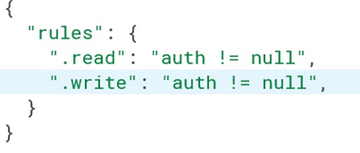
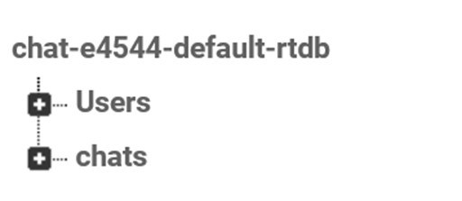
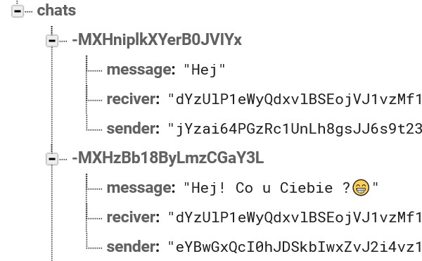
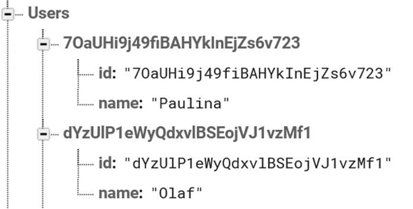
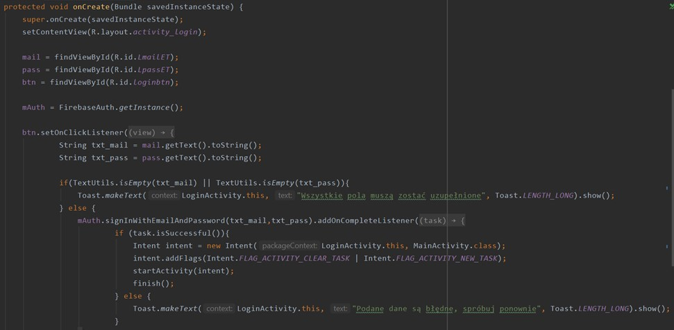
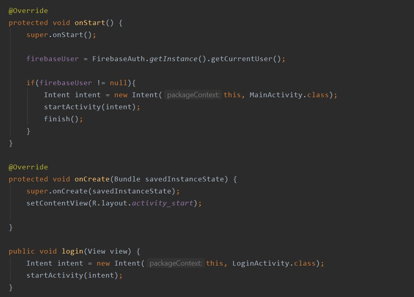
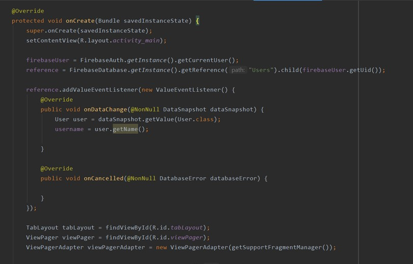
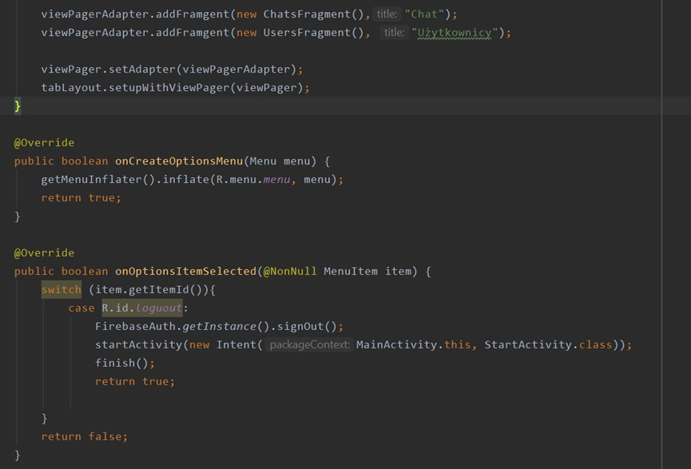
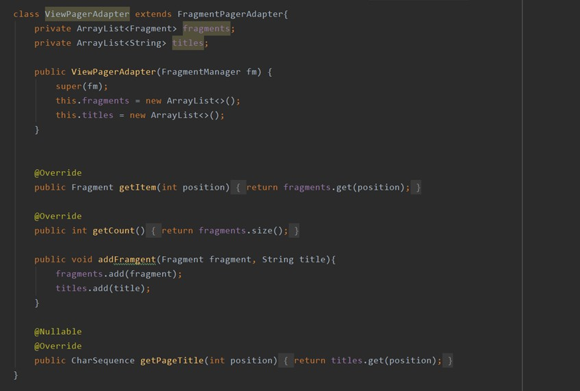

# ChatForYou

* [Informacje wstępne](#Informacjewstępne)
* [Interfejs](#Interfejs)
* [Kod](#Kod)

## Informacje wstępne

Przedmiot: Przetwarzanie danych w chmurze obliczeniowej

Rok akademicki: 2020/2021

Grupa: S22-32

Skład zespołu: Aleksandra Okrój, Natalia Skórowska 

IDE: Android Studio

Język: Java

Baza danych: Firebase

Nazwa aplikacji: Chat For You

Cel aplikacji: Aplikacja "Chat For You" służy do chatowania, wymiany wiadomości ze znajomymi. Użytkownicy zakładając konto podają imię, adres e-mail oraz hasło, a następnie mogą swobodnie poruszać się między dwoma ekranami: pierwszy z listą użytkowników z którymi mogą zacząć rozmowę, a drugi z listą rozpoczętych już wcześniej chatów. Dane użytkownika podane przez niego w momencie rejestracji, oraz wiadomości, które użytkownicy do siebie wysyłają są przechowywane w bazie danych firebase.

## Interfejs

Ekran początkowy:

Ekran rejestracji:

Ekran logowania:

Widok zakładek po zalogowaniu (zakładka z listą chatów i zakładka z listą użytkowników)

Widok rozmowy między użytkownikami:

 ## Kod 
Opis realizacji projektu:
 
 Stworzenie logo aplikacji, a następnie skonfigurowanie bazy danych wraz z mechanizmem uwierzytelnienia:
 
 
 
 
 
 
 RegisterActivity:

LoginActivity:

StartActivity:

MainActivity:

