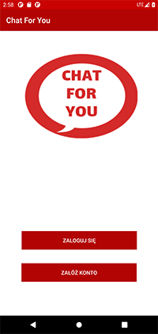
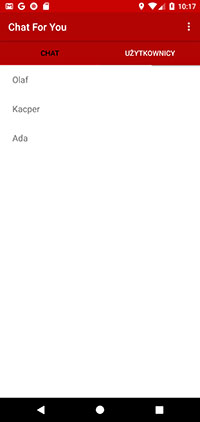
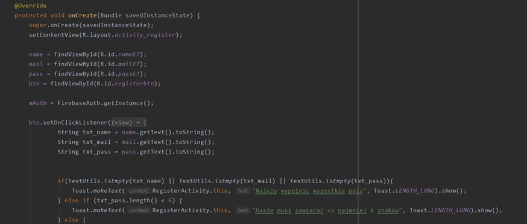
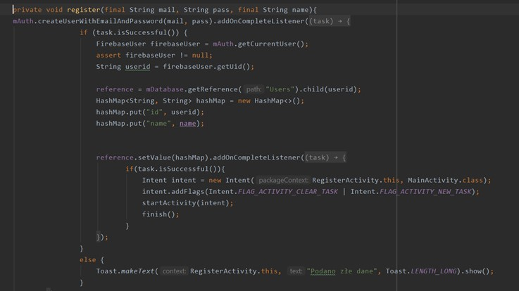
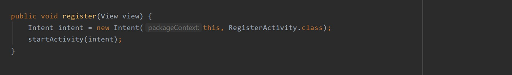
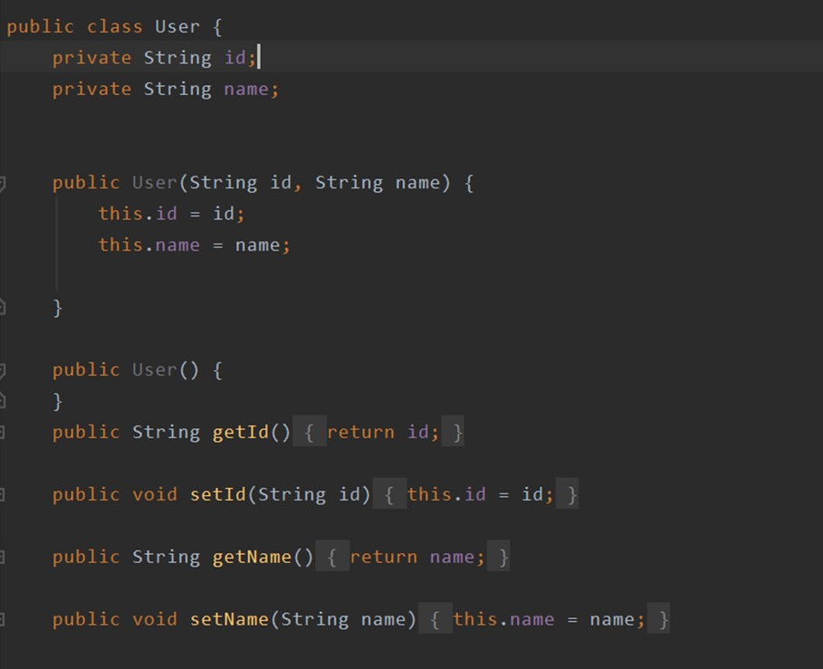

# ChatForYou

* [Informacje wstępne](#Informacjewstępne)
* [Interfejs](#Interfejs)
* [Kod](#Kod)

## Informacje wstępne

Przedmiot: Przetwarzanie danych w chmurze obliczeniowej

Rok akademicki: 2020/2021

Grupa: S22-32

Skład zespołu: Aleksandra Okrój, Natalia Skórowska 

IDE: Android Studio

Język: Java

Baza danych: Firebase

Nazwa aplikacji: Chat For You

Cel aplikacji: Aplikacja "Chat For You" służy do chatowania, wymiany wiadomości ze znajomymi. Użytkownicy zakładając konto podają imię, adres e-mail oraz hasło, a następnie mogą swobodnie poruszać się między dwoma ekranami: pierwszy z listą użytkowników z którymi mogą zacząć rozmowę, a drugi z listą rozpoczętych już wcześniej chatów. Dane użytkownika podane przez niego w momencie rejestracji, oraz wiadomości, które użytkownicy do siebie wysyłają są przechowywane w bazie danych firebase.

## Interfejs

Ekran początkowy:

Ekran rejestracji:

Ekran logowania:

Widok zakładek po zalogowaniu (zakładka z listą chatów i zakładka z listą użytkowników)

Widok rozmowy między użytkownikami:

 ## Kod 
Opis realizacji projektu:
 
 Stworzenie logo aplikacji, a następnie skonfigurowanie bazy danych wraz z mechanizmem uwierzytelnienia:
 
 
 
 
 
 
 RegisterActivity:
 
 Konfiguracja mechanizmu rejestracji, podłączenie do elementów interfejsu wcześniej zadeklarowanych zmiennych. Sprawdzenie czy 3 pola (imie, adres email, hasło), które użytkownik musi wypełnić podczas rejestracji zostały uzupełnione poprawnie. Jeśli hasło będzie miało mniej niż 6 znaków, lub nie wszystkie pola zostaną wypełnione użytkownikowi nie uda się zarejestrować i dzięki mechanizmowi toast zostaną wyświetlone komunikaty informujące o przyczynie niepowodzenia.

LoginActivity:

Konfiguracja mechanizmu logowania, podłączenie do elementów interfejsu wcześniej zadeklarowanych zmiennych. Przy logowaniu należy podać adres email oraz hasło. Jeśli wpisane dane nie zgadzają się z danymi z bazy zostaje wyświetlony stosowny komunikat o tym informujący (toast).

StartActivity:

Zadeklarowanie zmiennych i podłączenie do nich elementów interfejsu. Po kliknięciu buttona "Załóż konto" użytownik zostaje przeniesiony do ekranu umożliwiającego rejestrację (RegisterActivity). Po kliknięciu buttona "Zaloguj się" użytkownik zostaje przeniesiony do ekranu umożliwiającego logowanie (LoginActivity).

MainActivity:

Ekran widoczny po zalogowaniu użytkownika do systemu. Do zakładki "Użytkownicy" pobierana zostaje z bazy danych lista zarejestrowanych w tej aplikacji użytkowników. Po kliknięciu w imię danego użytkownika następuje przejście do chatu z nim. Do zakładki "Chaty" pobierana zostaje z bazy danych lista osób, z którymi wcześniej prowadził chat zalogowany użytkownik. Po kliknięciu na imię danego użytkownika otwarty zostaje chat z nim i pobrane zostają poprzednie wiadomości z nim wymienione.

User Model:

Stworzenie modelu użytkownika wykorzystująceg id oraz imię użytkownika. Wygenerowanie getterów i setterów.

Chat Model:

Stworzenie modelu chatu między dwoma użytkownikami, który zawiera pola: nadawca, odbiorca oraz treść wiadomości. Wygenerowanie getterów i setterów.

Message adapter:

User adapter:

User fragment:

Chat fragment:

Widok chatu między dwoma użytkownikami. Pobranie z bazy poprzednich wiadomości jeśli takie wystąpiły. 

